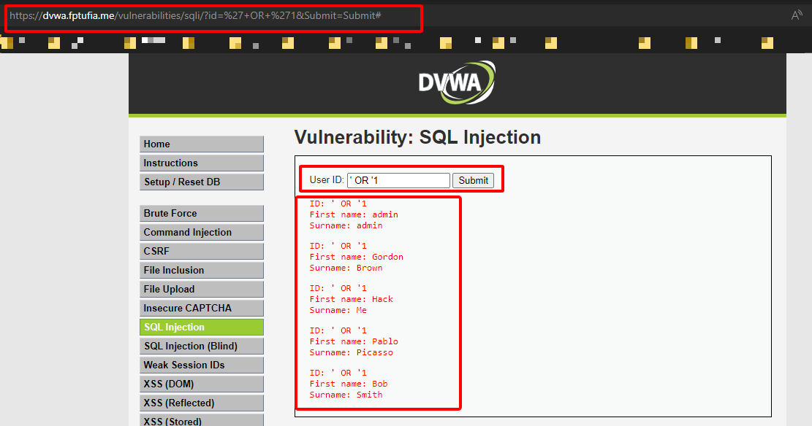

# Authentication Testing (Broken Authentication) - Top 10 OWASP 2017

## 1. Bypassing Authentication Schema
Trong lỗ hổng *Broken Authentication*, thì Bypassing Authentication Scheme là một nhánh nhỏ của lỗ hổng này. Có thể biết rằng các phần mềm hoặc ứng dụng thường yêu cầu xác thực để có thể truy cập vào, ví dụ: email, username, password, …Và Bypassing Authentication (Bypass Authen) là phần rất dễ bị tấn công. Nó cho phép attacker bỏ qua các bước xác thực và giành quyền truy cập vào ứng dụng và dữ liệu. Từ đó có thể thực hiện các hành động nguy hiểm khác như cài back-door, đánh cắp thông tin, can thiệp tiến trình của ứng dụng…

---
## 2. Detect and Exploit
### 2.1 Làm thế nào để phát hiện?
  - **Kiểm tra log hệ thống**: để xác định các hoạt động đăng nhập bất thường hoặc liên quan đến việc truy cập trái phép vào hệ thống.
    ```json
    // Kibana log
    {
      "_index": "logstash-2021.08.24",
      "_type": "_doc",
      "_id": "Nv1ZQXsBz-C0I8A9MGo9",
      "_score": null,
      "_source": {
        "@timestamp": "2021-08-24T12:08:37.000Z",
        "agent": "Mozilla/5.0 (Windows NT 10.0; Win64; x64) AppleWebKit/537.36 (KHTML, like Gecko) Chrome/93.0.4577.63 Safari/537.36",
        "client_ip": "192.168.1.10",
        "host": "example.com",
        "message": "Failed login attempt for admin",
        "status": 401,
        "tags": [
          "authentication",
          "failed-login",
          "bypassing-authentication"
        ],
        "url": "/admin/login.php",
        "user_agent": "Mozilla/5.0 (Windows NT 10.0; Win64; x64) AppleWebKit/537.36 (KHTML, like Gecko) Chrome/93.0.4577.63 Safari/537.36",
        "user_name": "admin"
      },
      "fields": {
        "@timestamp": [
          "2021-08-24T12:08:37.000Z"
        ]
      },
      "sort": [
        1629808117000
      ]
    }
    ```

  - **Giám sát lưu lượng mạng**: để theo dõi lưu lượng mạng cũng như xác định các hoạt động bất thường, chẳng hạn như các yêu cầu đến trang đăng nhập không hợp lệ hoặc một lượng lớn các gói tin được gửi đến server.
  - **Xác nhận đầu vào**: kiểm tra xem đầu vào có chứa các ký tự đặc biệt như %00 (**URL encode**), hoặc ký tự mã hóa nào đó có thể bypass công cụ kiểm tra đầu vào.

### 2.2 Làm sao để khai thác?
- **Khai thác các lỗ hổng**: là quá trình mà attacker tìm kiếm, xác định và tận dụng các lỗ hổng bảo mật trong các ứng dụng hoặc hệ thống, chẳng hạn như **SQL injection** hoặc **Cross-Site Scripting** (XSS).
    
    Link Test: **[LINK](https://dvwa.fptufia.me/)**
    
    * **Ví dụ về lỗ hổng SQLi**
    
    
    ```=> Có thể thấy chỉ cần một thực hiện một số thao tác là ta có thể truy vấn được dữ liệu từ database.```

    * **Ví dụ về lỗ hổng XSS**
    
    
    
    
    ```=> Sau khi xác định được trang web có lổ hổng XSS thì attacker có thể tấn công  bằng cách chèn mã độc vào các trang web được yêu cầu bởi user để đánh cắp thông tin đăng nhập hoặc thực hiện các hành động khác.```
       
- **File Path Traversal**: là một kỹ thuật cho phép attacker truy cập vào các tập tin hoặc thư mục trên web server bằng cách sử dụng các ký tự đặc biệt để đánh lừa hệ thống. 
    
    Link Test: **[LINK](https://portswigger.net/web-security/file-path-traversal).**
    
    
    
    ```=> Lợi dụng lỗi hổng này attacker có thể đọc được các file config của web server - nơi có thể chứa thông tin kết nối với database, hoặc có thể biết được tài khoản user từ các file "/etc/passwd", "/etc/shadow".```

- **Thao tác với Cookies**: là kỹ thuật tấn công mà attacker sửa đổi các giá trị của cookie từ đó có thể bypass các biện pháp bảo mật như xác thực và phân quyền.
    
    Link Test: **[LINK](https://www.root-me.org/en/Challenges/Web-Server/HTTP-Cookies)**
    
    
    
    
    ```=> Có thể thấy chỉ cần thay đổi một giá trị của cookies thì attacker đã có thể đánh lừa được web server và truy cập vào tài quyên của hệ thống đang được bảo vệ.```
---
## 3. Ảnh hưởng gây ra bởi lỗ hổng này
Từ những điều trên ta có thể thấy được sự ảnh hưởng của Bypassing Authentication Schema
- Đánh cắp thông tin cá nhân
- Phá hoại dữ liệu hoặc cơ sở dữ liệu
- Lợi dụng tài nguyên hệ thống
- Ảnh hưởng đến uy tín của công ty hoặc tổ chức.

---
## 4. Làm sao để giảm hoặc ngăn chặn
- Cập nhật các phần mềm: Sử dụng các phần mềm mới nhất để đảm bảo rằng các lỗ hổng bảo mật đã được vá.
- Triển khai xác thực hai yếu tố: Xác thực hai yếu tố (2FA) thêm một lớp bảo mật bổ sung bằng cách yêu cầu người dùng cung cấp hình thức nhận dạng thứ hai, chẳng hạn như tin nhắn văn bản, email hoặc OTP, ngoài tên người dùng và mật khẩu của họ.
- Triển khai Hệ thống Phát hiện Xâm nhập: Hệ thống Phát hiện Xâm nhập - Intrusion Detection Systems (IDS) có thể giám sát lưu lượng mạng và xác định bất kỳ hoạt động đáng ngờ nào.
- Giới hạn số lần đăng nhập: Điều này có thể ngăn chặn được các cuộc tấn công Brute-Force.
- Sử dụng các kỹ thuật mã hóa: Sử dụng mã hóa để bảo vệ các thông tin nhạy cảm, đặc biệt là các thông tin liên quan đến đăng nhập và quản lý tài khoản.
- Thực hiện kiểm tra và xử lý đầu vào từ người dùng, đảm bảo rằng dữ liệu đầu vào được kiểm tra kỹ lưỡng và loại bỏ các ký tự đặc biệt và mã độc.
- Theo dõi các hoạt động bất thường trên hệ thống, bao gồm HTTP requests không hợp lệ, các truy cập không xác định và các yêu cầu từ các địa chỉ IP không quen thuộc.
- Đào tạo nhân viên về các vấn đề bảo mật và cách phát hiện các cuộc tấn công bảo mật.
---